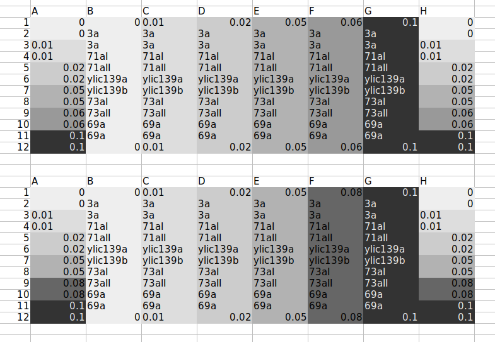

# Title:  Biotek - 2nd experiment for paper all strains

## Date

17052021-21052021

## Objective

- To check that the sfGFP do not influence the phenotype of the population growth of the pGal strains 

## Method

- Population growth rate in the Biotek
- Layout:Two plates 

- Initial amount from thawed glycerol stock:

    - 5ul for ywkd073I and ywkd073II (from previous miserable growth)
    - 1ul for the rest 

- Measuring 

  - 100x dilution for ywkd073I and ywkd073II
  - 200x dilution for the rest 

## Results

## Conclusion