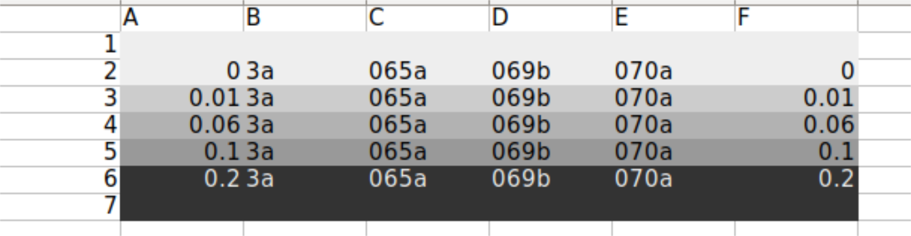

# Title : do yeast cells show multinuclei upon CDC42 depletion? (test)

## Date

29092022 (thursday)-

## Objective

- We got a rebuttal from a reviewer asking us check the cell morphology in log phase for some galactose concentrations, to see if they look healthy.
- We also got a request to check if CDC42 depletion causes multinuclei in the cells.

## Method

This implies we should do the following:

1. Set up a population growth experiment with the following strains: WT+sfGFP+pGal-CDC42(ywkd065a),dbem1+sfGFP+pGal-CDC42(ywkd069b),dbem1dbem3+sfGFP+pGal-CDC42(ywkd070a),WT(yll3a Control). The population growth experiment should be done  considering two phases: incubation(30C)+measuring(36C).
2. After the measuring part , when the cells reach saturation , then we should DAPI stain them and check for multinuclei.
3. We will measure in : 0,0.01,0.06,0.1 amd 0.2% galactose.

For the population growth:

Incubation: 30C at 10:30am 29092022(thursday)
- 1ul of glycerol stock in 100ul media
- Base media: 4xCSM-LF+2% Raffinose

Measuring: 36C at 10:30am 01102022(Saturday)
- 1ul from incubated cells in 100ul media
- Base media: 4xCSM-LF+2% Raffinose

### Plate Layout

### Protocol for DAPI staining

From https://www.protocols.io/view/Yeast-DAPI-Staining-kqdg3p41l25z/v1?step=8

1. Grow up yeast in liquid medium overnight. The OD may not matter too much here, but something in the 0.8 - 2 range is probably ideal. 
2. Add 333 μL (or 1 volume) yeast culture to a 1.5 mL microcentrifuge tube. 
3. Add 666 μL (or 2 volume) of 100% Ethanol to the 1.5 mL microcentrifuge tube. 
4. Let the yeast ethanol mixture sit at room temperature for 30-60 minutes. 
5. Spin down yeast cells for 1 minute at 2500 RPM. 
6. Pour out the supernatant and resuspend the pellet in 1mL of 1 x PBS(1X PBS (Phosphate-buffered saline )), then centrifuge for 1 minute at 2500 RPM. 
7. Pour out the supernatant and resuspend the pellet in 200 μL of a 1 x PBS / 1:2000 Dilution DAPI mixture [^1].
8. Add one drop of the yeast suspended in the PBS / DAPI mixture onto a microscope slide, add a coverslip on top, and go observe the stained yeast.  *Make sure after you do this part to go look at it within a few hours of resuspending in PBS / DAPI. The sooner you can get to a microscope the better.*

[^1]:Add 1 mL 1 x PBS to a 1.5 mL microcentrifuge tube.Add 0.5 μL of a 2.5 mg/mL (or a 1:2000 dilution) of DAPI to the 1 x PBS.  

## Results

## Conclusion